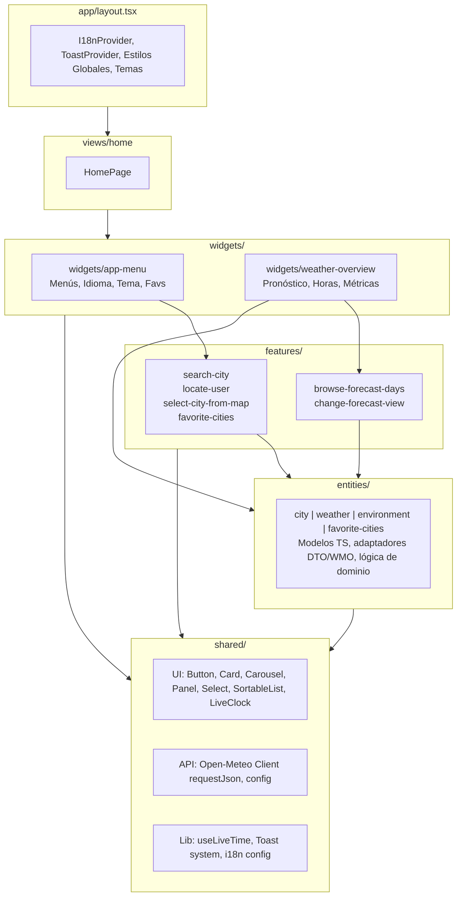
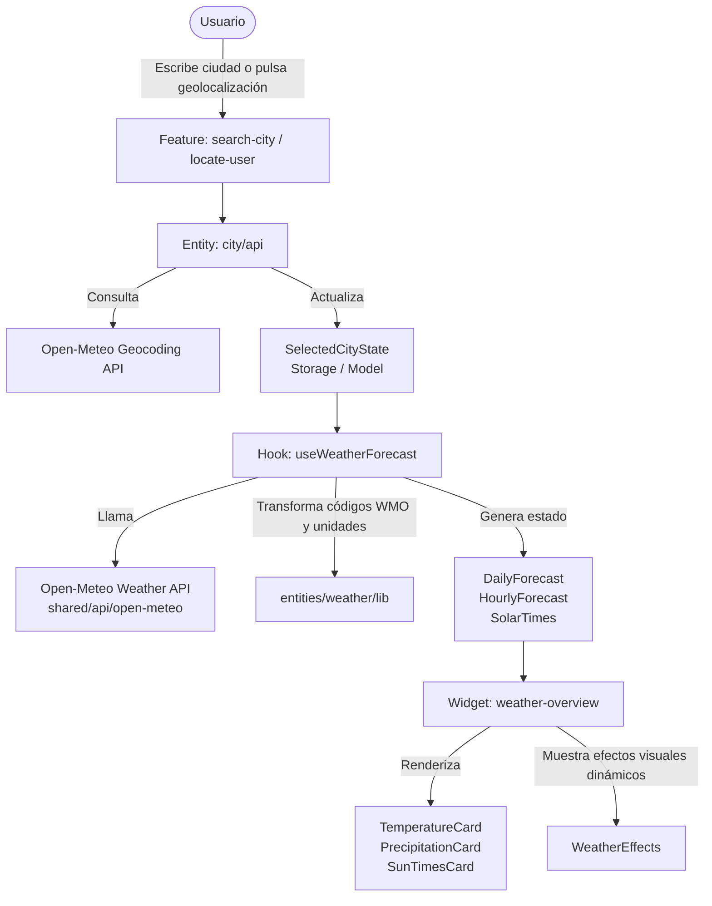

# 🌤️ Meeteo

Aplicación multiplataforma de consulta meteorológica y condiciones ambientales en tiempo real, desarrollada con **Next.js (React)**, **TypeScript**, **Tailwind CSS** y empaquetada para móviles con **Capacitor**.

---

## 📑 Tabla de Contenidos
- [Características](#-características)
- [Arquitectura del Proyecto (FSD)](#-arquitectura-del-proyecto-fsd)
- [Esquemas de Flujo y Jerarquía](#-esquemas-de-flujo-y-jerarquía)
  - [1. Flujo de Datos y Jerarquía de Capas](#1-flujo-de-datos-y-jerarquía-de-capas)
  - [2. Ciclo de Consulta Meteorológica](#2-ciclo-de-consulta-meteorológica)
- [Estructura del Repositorio](#-estructura-del-repositorio)
- [Pila Tecnológica](#-pila-tecnológica)
- [Instalación y Configuración](#-instalación-y-configuración)
- [Scripts Disponibles](#-scripts-disponibles)
- [Testing y Calidad](#-testing-y-calidad)

---

## ✨ Características

- 🌡️ **Pronóstico detallado:** Previsiones horarias y diarias (temperatura, precipitación, horas de sol, índice UV).
- 🍃 **Calidad del aire y alérgenos:** Mediciones ambientales y niveles de polen en tiempo real.
- 📍 **Geolocalización y búsqueda predictiva:** Detección de ubicación actual y buscador de ciudades mediante autocompletado y mapa interactivo.
- ⭐ **Gestión de favoritos:** Guardado, reordenación por arrastre (drag and drop) y botones de flecha de ubicaciones frecuentes en almacenamiento local.
- 🌐 **Internacionalización (i18n):** Soporte multiidioma con detección y cambio en caliente (Español / Inglés).
- 🎨 **Tema Solar Dinámico:** Adaptación visual al ciclo día/noche y preferencias de usuario.
- 📱 **Multiplataforma:** Experiencia PWA web y compilación nativa para **Android** e **iOS** vía Capacitor.

---

## 🏛 Arquitectura del Proyecto (FSD)

El código sigue estrictamente los principios de **Feature-Sliced Design (FSD)**, garantizando bajo acoplamiento, alta cohesión y una regla de importación **unidireccional descendente**:

```text
    app           -> Configuración global, providers y layouts
     ↓
    views         -> Páginas de la aplicación (Home, etc.)
     ↓
    widgets       -> Bloques autónomos y compuestos de interfaz
     ↓
    features      -> Interacciones de usuario con impacto de negocio
     ↓
    entities      -> Modelos de dominio y lógica de negocio central
     ↓
    shared        -> Componentes de UI agnósticos, librerías y clientes API
```

> **Regla de oro:** Una capa inferior nunca puede importar elementos de una capa superior.

---

## 📊 Esquemas de Flujo y Jerarquía

### 1. Flujo de Datos y Jerarquía de Capas



---

### 2. Ciclo de Consulta Meteorológica



---

## 📁 Estructura del Repositorio

```text
meeteo/
├── android/              # Configuración y proyecto nativo de Android
├── app/                  # Rutas, Layouts y Providers (Next.js App Router)
│   ├── providers/        # Proveedores de contexto globales (I18n, etc.)
│   ├── styles/           # Estilos CSS globales y variables
│   ├── layout.tsx        # Layout principal de la app
│   └── page.tsx          # Punto de entrada raíz
├── entities/             # Entidades de dominio (City, Weather, Environment, etc.)
│   ├── {entity}/api      # Clientes y tipos de respuesta de la entidad
│   ├── {entity}/model    # Modelos de TypeScript y lógica de negocio
│   ├── {entity}/lib      # Mappers y transformadores de datos
│   └── {entity}/ui       # Tarjetas y componentes visuales propios de la entidad
├── features/             # Acciones de usuario (Search, Locate, ChangeTheme, etc.)
├── ios/                  # Proyecto nativo de iOS (Xcode / CocoaPods / SPM)
├── shared/               # Recursos compartidos y reutilizables
│   ├── api/              # Cliente HTTP base y servicios externos
│   ├── config/           # Configuración de temas, i18n y constantes
│   ├── lib/              # Utilidades transversales (Toast, reloj, fecha)
│   └── ui/               # Componentes atómicos (Botones, Paneles, Modales)
├── tests/                # Batería de pruebas automatizadas
│   ├── unit/             # Pruebas unitarias de modelos y utilidades
│   ├── component/        # Pruebas de integración de componentes React
│   └── e2e/              # Pruebas end-to-end con Playwright
├── views/                # Composición final de páginas (views/home)
└── widgets/              # Bloques de UI orquestadores (WeatherOverview, AppMenu)
```

---

## 🛠 Pila Tecnológica

| Categoría | Tecnologías |
| :--- | :--- |
| **Framework Web** | [Next.js](https://nextjs.org/) (App Router), [React](https://react.dev/) |
| **Lenguaje** | [TypeScript](https://www.typescriptlang.org/) |
| **Estilos y Diseño** | [Tailwind CSS](https://tailwindcss.com/), CSS Modules / Variables CSS |
| **Mobile Runtime** | [Capacitor](https://capacitorjs.com/) (Android & iOS) |
| **APIs Externas** | [Open-Meteo](https://open-meteo.com/) (Forecast, Geocoding, Air Quality) |
| **Testing** | [Jest](https://jestjs.io/), [React Testing Library](https://testing-library.com/), [Playwright](https://playwright.dev/) |
| **Gestor de Paquetes**| [pnpm](https://pnpm.io/) |

---

## 🚀 Instalación y Configuración

### Prerrequisitos
- **Node.js**: v18.0.0 o superior
- **pnpm**: v8.0.0 o superior
- *(Opcional para compilación móvil)*: **Android Studio** (Android SDK) / **Xcode** (macOS para iOS).

### Pasos
1. **Clonar el repositorio:**
   ```bash
   git clone https://github.com/pablopez/meeteo.git
   cd meeteo/meeteo
   ```

2. **Instalar dependencias:**
   ```bash
   pnpm install
   ```

3. **Ejecutar el entorno de desarrollo:**
   ```bash
   pnpm dev
   ```
   Abre [http://localhost:3000](http://localhost:3000) en tu navegador.

---

## 📜 Scripts Disponibles

En el `package.json` dispones de los siguientes scripts principales:

- `pnpm dev`: Inicia el servidor de desarrollo de Next.js.
- `pnpm build`: Genera la compilación de producción optimizada.
- `pnpm start`: Arranca el servidor en modo producción.
- `pnpm lint`: Ejecuta ESLint para comprobar estilos y buenas prácticas.
- `pnpm typecheck`: Verifica los tipos de TypeScript sin emitir archivos.
- `pnpm test`: Lanza los tests unitarios y de componentes con Jest.
- `pnpm test:e2e`: Ejecuta las pruebas de extremo a extremo con Playwright.
- `pnpm build:mobile`: Genera la build de producción y sincroniza con las plataformas nativas Android e iOS.
- `pnpm open:android`: Abre el proyecto en Android Studio.
- `pnpm open:ios`: Abre el proyecto en Xcode.

---

## 🧪 Testing y Calidad

El proyecto implementa una pirámide de tests exhaustiva:

```text
           /---\
          / E2E \       --> Playwright (Flujos completos de usuario)
         /-------\
        /  Comp.  \     --> React Testing Library (Widgets, Features, UI)
       /-----------\
      /   Unitarios \   --> Jest (Mappers WMO, geocodificación, lib/time)
     /---------------\
```

Para ejecutar la suite completa de pruebas:
```bash
# Tests unitarios y de integración de componentes
pnpm test

# Tests E2E en navegadores reales
pnpm test:e2e
```
